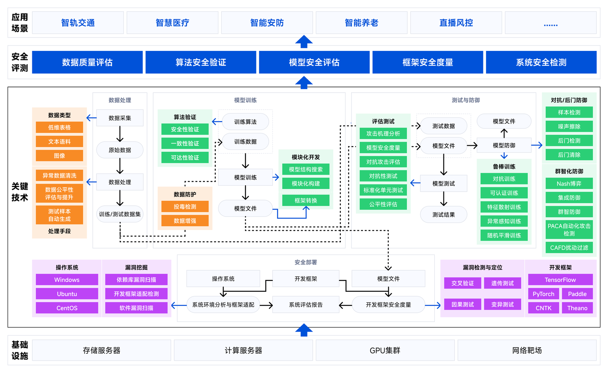

# 人工智能安全理论及验证平台
人工智能安全评测平台AIcert是浙江大学区块链与数据安全全国重点实验室人工智能数据安全团队在科技部科技创新2030-“新一代人工智能”重大项目等多个国家级/省部级项目以及浙江大学区块链与数据安全全国重点实验室的共同支持下研发的基于AI系统行为安全验证理论、模型自动建模开发、六维综合量化评估等先进技术实现的多层面全方位全栈安全评测平台。

<!-- <video id="video" controls="" preload="none" poster="封面">
      <source id="mp4" src="web/static/img/architecture.mp4" type="video/mp4"> 
</video>-->
 

AIcert解决了从数据到系统、从算法开发到系统部署的多层面全方位安全检测技术覆盖，实现了包括数据质量评估、算法安全验证、模型安全评测、框架安全度量、系统安全检测在内的五大5核心层面的AI系统全栈安全评测体系与技术平台。

- 可视化、形式化的理论验证；
- 高效率、自动化的安全开发；
- 多维度、系统化的量化分析。

## 文档

**介绍文档**：我们提供[功能介绍文档](web/static/pdf/AI%E5%B9%B3%E5%8F%B0%E4%BB%8B%E7%BB%8D%E6%96%87%E6%A1%A3v8.pdf)、[API说明文档](https://n1nltex7w5.feishu.cn/docx/LbN2dsyYZo4jn9xCMm5c3HEdnSf?from=from_copylink)

## 快速开始

<!-- ### 平台整体部署 -->
### STEP 1. 获取项目
```bash
https://github.com/ZJUICSR/AIcert.git
``` 
或
```bash
https://gitee.com/aisecurity/AIcert.git
``` 
### STEP 2. 环境配置
python环境要求
```bash
python>=3.7, <3.10
```
安装依赖
```bash
cd AIcert
pip install -r requirement.txt
```

### STEP 3. 数据与模型准备
下载数据集、预训练模型
<!-- 数据集下载：
```bash

```

模型下载：
```bash

```-->

### STEP 4. 运行

AIcert提供了前端展示界面，运行代码：
```bash
python main.py  --port 端口
```
使用Google浏览器打开界面


 ### 项目基本架构介绍：
 <!-- - config: web运行时的设置（不需要管）   -->
<!-- - logs: 日志存储文件，暂时没做   -->
 - dataset：数据集缓存目录，可下载数据集到目录下，如MNIST\CIFAR10等；

 - function：功能代码目录，存放调用脚本与算法代码；

 - model： 模型训练代码与预训练模型缓存目录；

 - output： 功能输出路径，任务中心在output中获取执行结果；

 - utils：函数工具库； 

 - web：前端文件；  

<!-- ### web目录：

static 为静态目录，其下的所有文件在整个flask框架启动后，前端都可以访问到，flask也可以自行指定static目录  
templates：存储所有的前端html页面  
view：后台与前端的接口，每个python文件为一个蓝图，在flask生成时需要进行注册。 -->

## 联系我们
如果你有任何疑问或需要帮助，请随时[联系我们](zju.aicert@gmail.com)。

## 协议
AIcert基于MulanPSL-2.0协议，关于协议的更多信息，请参看[LICENSE](https://github.com/ZJUICSR/AIcert/blob/main/LICENSE)文件。
